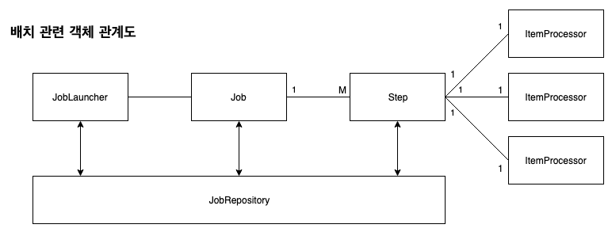

# 1장 - 오브젝트와 의존관계

## 1.2 관심사의 분리

### 관심사의 분리(Separation of Concerns)

* 관심이 같은 것끼리는 하나의 객체 안으로 또는 친한 객체로 모이게 하고, 관심이 다른 것은 가능한 한 따로 떨어져서 서로 영향을 주지 않도록 분리하는 것
* MVC 패턴도 이러한 관심사를 분리하기 위해 나온 것
* 참고 :[https://medium.com/@jijipapa/관심사의-분리-separation-of-concerns-soc-8a8d09df066d](https://medium.com/@jijipapa/%EA%B4%80%EC%8B%AC%EC%82%AC%EC%9D%98-%EB%B6%84%EB%A6%AC-separation-of-concerns-soc-8a8d09df066d)

## 1.2.3 DB 커넥션 만들기의 독립

### 템플릿 메소드 패턴(Template method pattern)

* 상속을 통해 슈퍼클래스의 기능을 확장할 때 사용하는 가장 대표적인 방법
* 변하지 않는 기능은 **슈퍼클래스**에 만들고, 자주 변경되며 확장할 기능은 **서브클래스**에서 만든다
* 슈퍼클래스에 기본적인 로직의 흐름을 만들고, 그 기능의 일부를 추상 메소드나 오버라이딩이 가능한 protected 메소드 등으로 만든 뒤 서브클래스에서 이런 메소드를 필요에 맞게 구현해서 사용
* 스프링에서 애용되는 디자인 패턴

<figure><figcaption></figcaption></figure>

### 팩토리 메소드 패턴(Factory method pattern)

* **서브클래스**에서 구체적인 오브젝트 생성 방법을 결정하게 하는 것
* 수정에 닫혀있고 확장에는 열려있는 OCP 원칙을 지킬 수 있다
* 참고 : [https://bcp0109.tistory.com/367](https://bcp0109.tistory.com/367)

## 1.3.4 원칙과 패턴

### 개방 폐쇄 원칙(OCP, Open-Closed Principle)

* 클래스나 모듈은 확장에는 열려 있어야 하고 변경에는 닫혀 있어야 한다
* 참고 - 객체지향 설계 원칙(SOLID)
  * SRP : 단일 책임 원칙
  * OCP : 개방 폐쇄 원칙
  * LSP : 리스코프 치환 원칙
  * ISP : 인터페이스 분리 원칙
  * DIP : 의존관계 역전 원칙

### 높은 응집도와 낮은 결합도

* OCP는 높은 응집도와 낮은 결합도라는 원리로도 설명 가능
* **응집도가 높다**는 것은 하나의 모듈, 클래스가 하나의 책임 또는 관심사에만 집중되어 있다는 뜻
* **결합도가 낮다**는 것은 책임과 관심사가 다른 오브젝트 또는 모듈과는 느슨하게 연결된 형태를 유지하는 것

### 전략 패턴(Strategy Pattern)

* 자주 사용되는 패턴이자 개방 폐쇄 원칙에도 잘 들어 맞는 패턴
* 자신의 기능 맥락에서 필요에 따라 변경이 필요한 알고리즘을 인터페이스를 통해 통째로 외부로 분리시키고, 이를 구현한 구체적인 알고리즘 클래스를 필요에 따라 바꿔서 사용할 수 있게 하는 디자인 패턴

## 1.4.3 제어권의 이전을 통한 제어관계 역전

### 제어의 역전(IoC, Inversion of Control)

* 프로그램의 제어 흐름 구조가 뒤바뀌는 것
* IoC는 프레임워크만의 기술도 아니고 프레임워크가 꼭 필요한 개념도 아님
* IoC를 적용하면 설계가 깔끔해지고 유연성이 증가하며 확장성이 좋아짐

## 1.5 스프링의 IoC

### DaoFactory

* UserDao 뿐만 아니라 AccountDao, MessageDao 등을 만드는 DaoFactory
* connectionMaker() 의 경우 중복 로직이므로 공통 메서드로 추출하여 중복을 제거

```java
public class DaoFactory {
	public UserDao userDao() {
		return new UserDao(connectionMaker());
	}

	public AccountDao accountDao() {
		return new AccountDao(connectionMaker());
	}

	public MessageDao messageDao() {
		return new MessageDao(connectionMaker());
	}

	public ConnectionMaker connectionMaker() {
		return new DConnectionMaker();
	}
}
```

* **Bean** : 스프링이 제어권을 가지고 직접 만들고 관계를 부여하는 오브젝트, 즉 제어의 역전이 적용된 오브젝트
* DaoFactory의 경우 각 객체를 만드는 로직을 하나의 클래스에서 관리 → 스프링에서는 **애플리케이션 컨텍스트**가 빈의 생성, 관계설정 등의 제어 작업을 총괄 (직접적으로 이런 정보를 담고 있지는 않지만 이러한 로직으로 동작함)

### 1.5.3 스프링 IoC의 용어 정리

### IoC 컨테이너

* **IoC 방식으로 빈을 관리한다**는 의미에서 애플리케이션 컨텍스트나 빈 팩토리를 컨테이너 또는 **IoC 컨테이너** 라고 함

### 애플리케이션 컨텍스트

* ApplicationContext 인터페이스를 구현한 오브젝트
* 하나의 애플리케이션에서 이러한 애플리케이션 컨텍스트 오브젝트는 여러 개가 생성되어 사용 됨(p.102)
  * StaticApplicationContext, GenericApplicationContext, WebApplicationContext 등
  * 출처 : [https://gunju-ko.github.io/toby-spring/2019/03/25/IoC-컨테이너와-DI.html](https://gunju-ko.github.io/toby-spring/2019/03/25/IoC-%EC%BB%A8%ED%85%8C%EC%9D%B4%EB%84%88%EC%99%80-DI.html)

## 1.6 싱글톤 레지스트리와 오브젝트 스코프

### 오브젝트의 동일성과 동등성

* 동일성은 == 연산자, 두 개의 오브젝트가 완전히 같은 동일한 오브젝트인가
* 동등성은 equals() 메소드, 두 개의 오브젝트가 동일한 정보를 담고 있는 오브젝트인가
* 동일한 오브젝트는 동등하지만 그 반대는 참일 수도 거짓일 수도 있다
* 클래스에 equals() 를 재정의하지 않는다면 최상위 클래스인 Object의 equals() 메서드를 적용하며, 이 메서드는 두 오브젝트의 동일성을 비교하여 반환함 → 동등성을 비교하기 위해 equals()를 재정의 한다

## 1.6.1 싱글톤 레지스트리로서의 애플리케이션 컨텍스트

### 싱글톤 레지스트리

* 스프링은 자바의 싱글톤 패턴과 유사한 싱글톤 형태의 오브젝트를 만들고 관리하는 기능을 제공
* 참고 :[https://loosie.tistory.com/849](https://loosie.tistory.com/849)
